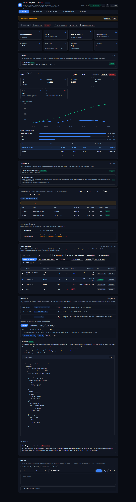

# WorkBuddy Local API Bridge

Expose the model capabilities of your locally-logged-in **WorkBuddy desktop app**
(DeepSeek / GLM / Kimi / MiniMax …) through a local bridge as **OpenAI-compatible**
and **Anthropic-compatible** APIs — so **Claude Code**, **opencode**, **Cursor**,
**Trae**, **Cherry Studio**, **NextChat**, **LobeChat**, **Open WebUI** or any client
with a custom Base URL can use them directly.

Also included: a web console (status / start-stop / diagnostics / model registration /
usage / health check / chat test) — **bilingual (Chinese / English, switchable in the
top-right corner, remembered locally)** — and an optional **DeepSeek Harness (dsh)
native plugin**.

> **In one line**: WorkBuddy quota → local API → any AI client you like.

> 🌏 **English summary only.** The full documentation is in Chinese
> ([README.md](README.md), [docs/](docs/)); both cover the same system.
> The console itself has a complete English UI — the `EN` toggle sits next to the
> theme switch.

## ⚠️ Read this first (disclaimer & boundaries)

- **Unofficial path.** This relies on the undocumented credential storage of the
  WorkBuddy desktop app. The upstream may change protocols or tighten risk control
  at any time (it already happened) — **no availability or compatibility guarantee**.
- **Only drives YOUR account.** It reads the credentials of the account logged in on
  **your own machine** and consumes its quota. **Do not** use it for multi-account
  pooling, proxying for others, or any resale/hosting service.
- **Check WorkBuddy's Terms of Service** before use; if they disallow this, don't use it.
- **No warranty.** Provided "as is" under MIT. Use a real API contract for anything
  long-term or commercial.
- Sharing the repo link, writing tutorials and sending PRs are welcome. **Do not**
  repackage it for sale, bundle it with payment, or collect anyone's credentials in
  its name.

## How it differs from similar tools

- **Opposite direction to claude-code-router (CCR)**: CCR injects other providers'
  APIs *into* Claude Code; this project exports *from* WorkBuddy to standard APIs.
  Complementary, not competing.
- **vs the WorkBuddy2API cluster (20+ projects)**: this one deliberately stays
  **single-account · credentials never hit disk · zero runtime dependencies ·
  single-file bridge**; no multi-account pooling, no task automation.

## Quick start (Windows)

1. `git clone https://github.com/Ianzhyh/workbuddy-to-dsh && cd workbuddy-to-dsh`
2. Double-click `启动.cmd` — it locates Node.js, starts the bridge + console and
   opens `http://127.0.0.1:8792` in your browser.
3. Open the **Client Access** tab for Base URL & token:
   - OpenAI-compatible: `http://127.0.0.1:8790/v1`
   - Anthropic: `http://127.0.0.1:8790` (no `/v1`)
   - API key: `wb-local-bridge` (or your `WORKBUDDY_LOCAL_TOKEN`)

DeepSeek Harness users: `dsh plugin add github:Ianzhyh/workbuddy-to-dsh`, then
register models in the plugin's settings page.

## Highlights

- **Zero runtime dependencies** — the bridge is a single self-contained file
  (`bridge/workbuddy-bridge.mjs`).
- **Credentials never hit disk** — AtRest keys are fetched from the desktop app via
  `ELECTRON_RUN_AS_NODE` on demand; plaintext tokens stay in memory only.
- **Both protocols**, streaming, tool calls, multi-turn tool results.
- **Ops features**: local rate limiting (opt-in), per-request overhead header,
  in-flight request visibility, `count_tokens`, client credential layering
  (per-key accounting / revocation / rate-limit buckets), local usage ledger.
- **Honest console** — 9 tabs of diagnostics that distinguish "model thinking"
  from "actually stuck", and never fake capabilities (embeddings return 501).
- **Bilingual console** — complete Chinese / English UI, switchable in-page
  (no reload, no build step); your choice is remembered.

## Configuration

Everything is optional; see [.env.example](.env.example) (Chinese comments).
Key knobs: `WORKBUDDY_PORT` / `WORKBUDDY_LOCAL_TOKEN` / `WORKBUDDY_ANTHROPIC_MODEL`
/ `WORKBUDDY_RATE_LIMIT_*` / `WORKBUDDY_CLIENT_KEYS` / `WORKBUDDY_CLIENT_*` etc.

## Documentation (Chinese)

- [Architecture](docs/ARCHITECTURE.md) · [Configuration](docs/CONFIGURATION.md)
- [Troubleshooting](docs/TROUBLESHOOTING.md) · [Security](docs/SECURITY.md)
- [OpenAPI](docs/openapi.yaml) · [Changelog](CHANGELOG.md) · [Contributing](CONTRIBUTING.md)

## License

MIT — see [LICENSE](LICENSE).
