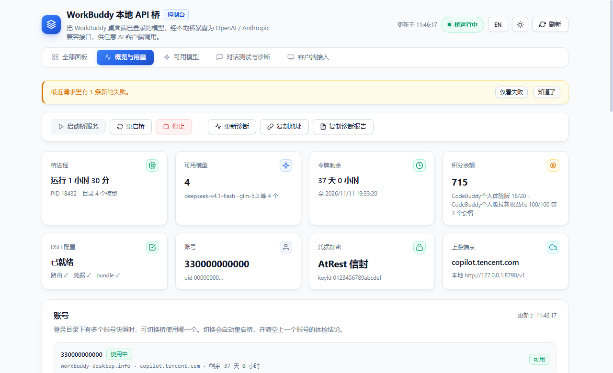
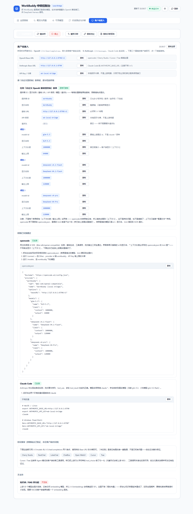
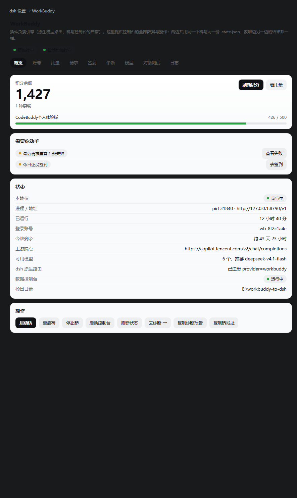

# WorkBuddy 本地 API 桥

> 🌏 English summary: [README.en.md](README.en.md)

把本机 **WorkBuddy 桌面端**已登录的模型能力（DeepSeek / GLM / Kimi / MiniMax 等），
经一个本地桥变成本机的 **OpenAI 兼容**与 **Anthropic 兼容**两套接口 ——
**Claude Code**、**opencode**、**Cursor**、**Trae**、**Cherry Studio**、**NextChat**、
**LobeChat**、**Open WebUI** 等任何支持自定义 Base URL 的客户端都能直连。

另附一个网页控制台（状态 / 启停 / 诊断 / 模型注册 / 用量 / 体检 / 对话测试），
**中 / 英双语**（右上角切换，选择记在本机），
以及一个可选的 **DeepSeek Harness（dsh）原生插件**（见下方说明）。

> **一句话**：WorkBuddy 的模型额度 → 本地 API → 你惯用的任意 AI 客户端。

<picture>
  <source media="(prefers-color-scheme: dark)" srcset="docs/console-hero-dark.png">
  
</picture>


**关键词**（便于检索，按关心的问题分组）：

| 你在找什么 | 相关词 |
|---|---|
| 把 WorkBuddy 用起来 | WorkBuddy · WorkBuddy 本地 API · WorkBuddy 模型桥 · WorkBuddy 中转 · WorkBuddy 插件 |
| 接某个客户端 | **WorkBuddy 接入 Claude Code** · WorkBuddy OpenAI 兼容 API · WorkBuddy Anthropic Messages 兼容 · Claude Code 自定义 API · opencode / Cursor / Trae / Cherry Studio / NextChat / LobeChat / ChatBox / Open WebUI 接入 |
| 接 DeepSeek Harness | DeepSeek Harness 插件 · dsh 插件 · dsh 模型路由 · provider workbuddy |
| 技术特性 | openai-compatible · anthropic-compatible · llm proxy · local model bridge · 零依赖 Node.js · 仅监听 127.0.0.1 · 本机凭据自用 |

> ### ⚠️ 请先读这一段（免责与边界）
>
> **这是一个自托管的开源工具：欢迎自用、欢迎分享源码，但它是非官方路径，风险自担。**
>
> - **非官方路径。** 它依赖 WorkBuddy 桌面端未公开的登录凭据存储格式。上游随时可能
>   改动协议或收紧风控（已经发生过——见[故障排查](docs/TROUBLESHOOTING.md)里的
>   真实案例），**可用性无任何保证**，且**不承诺任何兼容性**。把它当作「随时可能
>   需要更新甚至失效的互操作性实现」，而不是稳定服务。
> - **只驱动你自己的账号。** 它只读取**你自己机器上已登录**的那个账号，消耗该账号
>   自身的配额。**请勿**用它做多账号池化、代他人调用、或任何形式的转售 / 托管
>   服务 —— 那既违背本项目的设计初衷，也最容易触发上游风控（殃及所有用户）。
> - **请确认你符合 WorkBuddy 的服务条款。** 使用前请自行阅读并确认；若条款不允许，
>   请不要使用本项目。
> - **无担保。** 按 MIT 许可"按现状"提供。作者不对账号风控、额度异常或任何损失负责。
>   若你需要长期稳定、可商用的模型接入，**请申请官方 API**。
> - **自担风险的分享是欢迎的**：转发仓库链接、写教程、提 PR 都可以；但请**不要**
>   打包转售、绑定付费，或以本项目名义收集任何人的凭据。

### 这个项目与同类工具的关系

- **方向与 [claude-code-router](https://github.com/musistudio/claude-code-router) 相反**：
  CCR 把别家的 API **注入** Claude Code；本项目把 Claude Code 等**发给 WorkBuddy 的
  模型额度导出**成标准 API——两者互补而非竞争。
- **与 WorkBuddy2API 集群（社区 20+ 同目标项目）的差异**：本项目刻意保持
  **单账号 · 凭据不落盘 · 零运行时依赖 · 单文件自包含**；不支持也不计划支持
  多账号池化与任务自动化——如果你的需求是后者，社区里已有更对口的工具。
- 上游协议是**未公开接口**：所有同类项目都在同一片雷区里，失效与修复是常态。
  本项目的对策是[把排查写清楚](docs/TROUBLESHOOTING.md)（症状、证据、处置），
  而不是承诺稳定。
> - 详细的风险与边界见 [注意事项](#注意事项) 与 [docs/SECURITY.md](docs/SECURITY.md)。

**本仓库还提供一个 DeepSeek Harness 原生插件**（[`dsh-plugin/`](dsh-plugin/README.md)）：
装进 dsh 后，模型选择器里直接多出 provider `WorkBuddy`，设置里多一页 9 个标签页的数据面板；
插件自带桥与控制台，拷一个文件夹就能用。**它是可选的** —— 不用 dsh 的话，
前面说的本地 API 照常可用，只是没有那个原生集成。

只在本机回环地址上工作，不对外暴露，不内置任何密钥。

```sh
# ── 第 1 步：跑起来（所有用法都需要，与 dsh 无关）──────────────────────
git clone https://github.com/Ianzhyh/workbuddy-to-dsh.git
cd workbuddy-to-dsh
# 然后双击 启动.cmd —— 桥和控制台都会自动起来，不需要 npm install

# 或者只要桥、不开控制台：
bridge\start-bridge.cmd
```

跑起来后，去控制台「客户端接入」页签拿 Base URL 与令牌填进你的客户端
（见 [接入你的客户端](#接入你的客户端)）。**到这里就已经能用了。**

```sh
# ── 第 2 步（可选）：再装进 DeepSeek Harness ──────────────────────────
# 只有用 dsh 的人需要。三种方式装的是同一个插件，任选一种。

# 方式一：一条命令直装（v1.1.0 起，仓库根已声明 dsh.bundle）
dsh plugin --profile desktop add github:Ianzhyh/workbuddy-to-dsh

# 方式二：release 附件（tgz 安装包，无构建、无需 allowBuilds 授权）
#   从 GitHub Releases 下载 dsh-plugin-workbuddy-<版本>.tgz 后：
dsh plugin --profile desktop add ./dsh-plugin-workbuddy-1.3.1.tgz

# 方式三：从源码（插件在 dsh-plugin/ 子目录，接第 1 步的 git clone）
dsh plugin --profile desktop add workbuddy-to-dsh/dsh-plugin
# 装完重启一次 dsh；之后：设置 → WorkBuddy
```

> 三种方式装的是**同一个插件**。方式一/二由 npm 装仓库根包（Loader 行 name =
> `workbuddy-to-dsh`，对应根目录的 cordis.patch.yml）；方式三按子目录安装
> （name = `dsh-plugin-workbuddy`，对应 dsh-plugin/cordis.patch.yml）。
> 两份 patch 除 name 外完全一致，改动时需同步。

> 插件是**自带一切**的独立包（`npm run vendor` 生成的 `vendor/` 里含桥与控制台），
> 可以直接把 `dsh-plugin/` 文件夹拷给别人，对方不需要本仓库。
> 安装路线、验收清单与九条故障排查见 [docs/INSTALL.md](docs/INSTALL.md)。

---

## 它解决什么问题

WorkBuddy 的上游后端本身就讲 OpenAI 协议，官方只是没有开放公开入口，鉴权依赖桌面端
的登录会话。所以就协议层面而言，只需要一个薄薄的转发层。

真正的工程难点在于**从 WorkBuddy 5.6.0 起，官方开启了 AtRest 加密**：登录文件里的
`accessToken` / `refreshToken` 从明文 JWT 变成了 AES-256-GCM 信封，而解密密钥不落盘、
只存在于客户端进程内。这让所有在进程外读取该文件的既有工具全部失效。

本项目的做法是**请客户端自己完成解密**：以 `ELECTRON_RUN_AS_NODE=1` 运行
`WorkBuddy.exe`，调用它自己的原生绑定 `loggerGet()`，由客户端交出它本来就在用的
那把密钥。**没有任何密钥被写进代码或磁盘，登录文件也始终只读。**

> 这里刻意不做「破解」：不逆向密钥派生、不硬编码密钥、不改写登录文件。
> 密钥始终由客户端进程提供，本项目只是把它的结果用起来 —— 这也是它能长期跟上
> 客户端版本变化的原因。实现细节见 [`lib/atrest.mjs`](lib/atrest.mjs)。

---

## 前置条件

| 条件 | 说明 |
|---|---|
| Node.js | **18 或更高**（开发验证于 22.22.2）。无 npm 依赖，无需 `npm install` |
| WorkBuddy 桌面端 | **已安装且已登录**，进程可用（模型由它铸造的令牌驱动） |
| DeepSeek Harness | 可选。只有要接入 dsh 时才需要；桥本身对任意 OpenAI 客户端都可用 |
| 操作系统 | Windows 已验证；macOS / Linux 的路径与调用逻辑已实现但未实测 |

> 桥只驱动**本机已登录**的账号，不绕过任何鉴权，也不提供任何绕过方式。

---

## 快速开始

**双击根目录的 `启动.cmd`。就这一步。**

它会自动定位 Node.js、启动服务、并在浏览器里打开控制台——桥也会被自动拉起，
不需要任何手工操作。打开后即可看到桥已就绪和完整的模型列表。

> **首次使用**：桥起来之后，去「客户端接入」页签拿到 Base URL 与令牌，填进你的客户端即可
> —— 见下方[接入你的客户端](#接入你的客户端)。
> 若用 DeepSeek Harness，另外在「可用模型」里勾选所需模型并点「保存到 dsh 设置」，
> 再重启一次 dsh，模型就会出现在它的选择器里。

三个"不需要"：

- **不需要 `npm install`** —— 本项目零依赖
- **不需要改配置** —— 所有项都有合理默认值，`.env` 是可选的
- **不需要手工启动桥** —— 控制台会自动启动它（并复用已在运行的实例）

> 窗口保持打开即可。关掉窗口会停止控制台；桥在后台继续驻留，下次启动直接复用。

不想开控制台也可以（用的是同一套配置）：

```cmd
bridge\start-bridge.cmd     :: 只起桥
node tools\doctor.mjs       :: 命令行自检，输出缺失项与修法
```

### 把安装交给 Agent

不想照着文档一步步来？把下面这段话**整段粘给任意 AI Agent**（WorkBuddy 对话、
Claude Code、opencode…），它会替你完成判定 → 安装 → 验证，出错时自己查排错文档：

```text
请帮我在本机安装并验证 workbuddy-to-dsh（WorkBuddy 本地 API 桥）。步骤：

1. 环境判定：确认 Node.js 18+（node -v）；确认 WorkBuddy 桌面端已安装并登录过
   （Windows 下检查 %LOCALAPPDATA%\CodeBuddyExtension\Data\Public\auth\ 里是否有
   .info 登录文件；没有就先打开 WorkBuddy 登录一次）。
2. 获取代码：git clone https://github.com/Ianzhyh/workbuddy-to-dsh 并进入目录。
   本项目零依赖，不需要 npm install。
3. 启动：Windows 双击根目录的 启动.cmd（或 node dashboard/server.mjs）——它会自动
   启动桥并打开控制台（http://127.0.0.1:8792）。
4. 验证：运行 node tools/doctor.mjs 自检全部通过；再请求
   curl -H "Authorization: Bearer wb-local-bridge" http://127.0.0.1:8790/v1/models
   确认返回模型目录。
5. 若我是 DeepSeek Harness 用户：改用 dsh plugin add github:Ianzhyh/workbuddy-to-dsh
   直装插件，然后在 dsh 设置页的 WorkBuddy 分区完成模型注册并重启 dsh。
6. 遇到问题先读 docs/TROUBLESHOOTING.md，按里面的处置试过再带报错来问我。
全程只允许 127.0.0.1 本机回环，不要尝试改绑 0.0.0.0 或暴露到局域网。
```

---

## 接入你的客户端

<picture>
  <source media="(prefers-color-scheme: dark)" srcset="docs/clients-panel-dark.png">
  
</picture>

桥同时讲**两套协议**，填哪个地址取决于客户端讲哪套：

| 协议 | Base URL | API Key |
|---|---|---|
| OpenAI 兼容 | `http://127.0.0.1:8790/v1` | `wb-local-bridge`（或你设的 `WORKBUDDY_LOCAL_TOKEN`） |
| Anthropic Messages | `http://127.0.0.1:8790`（**不带 `/v1`**） | 同上 |

控制台的「客户端接入」页签里有每个客户端的完整配置片段，点一下即可复制。

**兼容性分三档，如实标注、不夸大：**

| 客户端 | 协议 | 状态 |
|---|---|---|
| opencode | OpenAI | ✅ 已实测 —— 用其底层 AI SDK（`@ai-sdk/openai-compatible`）跑通生成 / 工具调用 / 流式 |
| Claude Code | Anthropic | ✅ 已实测 —— 流式事件序列、`tool_use`、多轮 `tool_result` 往返均正确 |
| Cursor / Trae | OpenAI | ⚪ 协议兼容，未在客户端内实测（Agent 模式依赖的工具调用桥侧可用） |
| Cherry Studio / NextChat / LobeChat / ChatBox / Open WebUI | OpenAI | ⚪ 协议兼容，未在客户端内实测 |

> 「协议兼容」= 这些客户端只用 `/v1/models` 与 `/v1/chat/completions` 两个端点，
> 桥侧已验证；但**没有真的装一遍跑通**，所以不写成「支持」。

**Claude Code 的模型名会被映射。** 它发的是 `claude-sonnet-4-…`，上游没有这些 id，
桥会映射到真实模型（默认 `glm-5.3`）。想指定就用 `WORKBUDDY_ANTHROPIC_MODEL=<上游真实模型 id>`。

**已知限制：知识库 / RAG 用不了。** 上游只提供对话模型，没有任何 embedding 模型，
`POST /v1/embeddings` 会明确返回 **501**。需要 RAG 的客户端请另配一个 embedding
提供方——桥不做「假的向量」，那会让知识库看起来建成了、实际全是噪声。

---

## 作为 DeepSeek Harness 插件使用



本仓库同时提供 **DeepSeek Harness 原生插件**（[`dsh-plugin/`](dsh-plugin/README.md)）。
**插件和「桥 + 网页控制台」是一套东西的两个前端，不是二选一** ——
用不用 dsh 都能用这个项目，只是装了插件多一层原生集成：

> **插件当引擎，控制台的全部功能搬进 dsh 设置页 —— 两个前端、一个后端。**
> 插件在 dsh 里注册原生模型路由、把**桥和控制台都管起来**（已在跑就复用，没跑就拉起）；
> **设置 → WorkBuddy** 里有 9 个标签页：概览 / 账号 / 用量 / 请求 / 签到 / 诊断 / 模型 / 对话测试 / 日志，
> 功能与控制台网页**完全等价**：读同一个桥、写同一份 `.state.json`（账号切换等写操作由
> 插件透传给控制台执行，保证只有它写），在任意一边改，另一边同步变化。原控制台照常可用。

| | 装插件后 | 不装插件 |
|---|---|---|
| 模型注册 | 运行时注册 provider `workbuddy`，**不写任何配置文件** | 控制台写 `settings.yaml` + profile patch |
| 模型增删 | 动态跟随上游目录，改完即生效 | 需要重新勾选并保存 |
| 桥的启停 | 插件自动复用/拉起 | 控制台按钮，或 `启动.cmd` |
| 数据界面 | **dsh 设置页（9 个标签页）** + 控制台网页，两边同步 | 只有控制台网页 |
| agent 侧 | 5 个工具 + `/workbuddy` 命令 | 无 |

```sh
dsh plugin --profile desktop add <本仓库路径>/dsh-plugin
```

装完**重启一次 dsh**（插件模块与客户端引导行只在启动时组装）。
两种方式可以共存：控制台照旧能开，桥是同一个进程；但**不要同时保留旧的手写
`llm-pi-ai.providers.workbuddy` 路由**——插件首次加载会自动把它清掉（先备份）。

细节、配置项与验证记录见 [`dsh-plugin/README.md`](dsh-plugin/README.md)。

---

## 控制台

打开 <http://127.0.0.1:8792> 后：

| 区域 | 能做什么 |
|---|---|
| 顶部提示条 | 只显示**需要处理**的事：桥不可用 > 令牌临期 > 新失败 > 未签到；桥不可用不可关闭，其余可静默。标签页标题同步反映状态（含「新失败 N」） |
| 操作条 | 启动桥、重启桥、停止桥、重新诊断、复制桥地址（供其它 OpenAI 客户端填 Base URL）、**复制诊断报告**；危险动作都有二次确认（会提示将打断几条请求）；「刷新」一次覆盖全部面板 |
| 状态卡 | 账号、令牌剩余有效期、凭据加密方式、上游端点、**桥进程（PID / 运行时长 / 目录模型数）**、模型数、**积分余额**、dsh 就绪度 |
| 账号 | 登录目录下存在多个账号快照时，可在此切换桥使用哪一个（自动重启桥、记住选择，并清空上一个账号的体检结论） |
| 用量统计 | 最近 1 / 7 / 30 天的调用次数、token 数、平均耗时、**消耗积分**、失败数；**趋势图**可切指标（次数 / tokens / 积分）与粒度（按天 / 最近 24 小时），**积分排行**看「这段时间积分花在哪了」；可导出 CSV，也可**清空账本** |
| 最近请求 | 逐条请求明细（时间 / 模型 / 流式与否 / 耗时 / token / 积分 / 结果），**失败标红**并显示上游错误码，**点失败标签可一键复制错误详情**；支持**模型筛选** +「仅看失败」+ 40 / 100 / 200 条叠加，可**暂停自动刷新**、**导出当前筛选的 CSV**；只含元数据，不含对话内容 |
| 每日签到 | 查看今日签到状态与连续天数，一键领取；**每日自动签到**默认开启（桥自带定时器，**不开控制台、不调模型也会签**；签完即停，不做多余的检测），失败会留痕、可关闭 |
| 环境诊断 | 8 项检查，**按优先级排序**——红色项不解决，模型就不会出现 |
| 可用模型 | 实际可用的全部模型（不能对话的内部模型已在桥的目录层过滤），含上下文、输出上限、**消耗倍率**与**实测成本**；**体检范围可选**（勾选的 / 已注册的 / 全部），可**一键取消勾选不可用的**、**同步可用模型到 dsh**、**手动刷新目录**；点 **ⓘ** 看模型详情（中文描述 / 厂商 / 标签 / 精确上下文与输出）；导出 CSV |
| 对话测试 | **多轮对话**（带上下文）、按轮次分段、显示本轮 token / 扣分 / 耗时、回答可复制；流式输出可随时停止；附带桥日志（可按关键字过滤 / 只看错误 / 只看本次启动 / 清空） |
| 客户端接入 | 桥的两套协议地址与本地令牌（**点一下即复制**），以及各客户端的完整配置片段与**如实的兼容性分档**（已实测 / 协议兼容 / 不支持）；「复制全部配置」一次抄走 |

每个面板的表头都显示「数据更新于 HH:MM:SS」，页面上出现的结论都能对得上时间。
所有图表都是自己画的**零依赖内联 SVG**（没有引入任何图表库）。

控制台的所有接口见 [`dashboard/README.md`](dashboard/README.md#api)。

---

## 工作原理

桥同时讲**两套协议**，因为客户端说的是两套：

```
OpenAI 系客户端（opencode / Cursor / Trae / Cherry Studio …）
   │  POST /v1/chat/completions
   │
Claude Code
   │  POST /v1/messages            ← Anthropic Messages 协议
   ▼
bridge/workbuddy-bridge.mjs
   │  1. 注入鉴权头（凭据现取现解，不落盘）
   │  2. 保证流式（上游不接受非流式请求）
   │  3. 请求体归一化（developer → system、tool_choice 对象 → 字符串）
   │  4. Anthropic ↔ OpenAI 双向翻译（仅 /v1/messages 这条路径）
   ▼
copilot.tencent.com/v2/chat/completions   ← 上游只说 OpenAI 协议，且只支持流式
```

**OpenAI 那条路径基本不做协议翻译**——上游本来就说 OpenAI 协议，桥只做上面 1–3
三件适配。**Anthropic 那条必须翻译**：Claude Code 的请求结构、响应结构、流式事件
格式都与 OpenAI 不同，光把 Base URL 指过来会直接 404。

两条路径最终汇到上游同一个端点，所以**用量、积分、账本、控制台是统一的**。

上游比 OpenAI 规范更严的地方（`developer` 角色、`tool_choice` 只认字符串、首条必须
是 `system`）都在同一次归一化里处理；缺的能力（embedding）明确返回 501 而不是伪造。
详见 [`docs/ARCHITECTURE.md`](docs/ARCHITECTURE.md)。

---

## 配置

所有配置项都有合理默认值；完整清单（含中文说明）见 [.env.example](.env.example)。
机器可读的接口描述见 [docs/openapi.yaml](docs/openapi.yaml)（OpenAPI 3.1）。

统一配置真源是 [`config.mjs`](config.mjs)，优先级：
**进程环境变量 > `.env` > 内置默认值**。

```cmd
copy .env.example .env
```

常用项：

| 变量 | 默认值 | 说明 |
|---|---|---|
| `WORKBUDDY_PORT` | `8790` | 桥监听端口 |
| `WORKBUDDY_LOCAL_TOKEN` | `wb-local-bridge` | 本地回环令牌，仅防同机误用，**不是**上游凭据 |
| `DASHBOARD_PORT` | `8792` | 控制台端口 |
| `WORKBUDDY_APP_EXECUTABLE` | 自动探测 | WorkBuddy 客户端路径 |
| `WORKBUDDY_AUTH_FILE` | 自动定位 | 登录文件；多账号时务必显式指定 |
| `WORKBUDDY_ANTHROPIC_MODEL` | `glm-5.3` | Claude Code 的模型名映射到哪个真实模型（也可直接填上游真实 id） |
| `WORKBUDDY_ANTHROPIC_FAST_MODEL` | `glm-5.3-flash` | Claude Code 后台任务（标题生成、文件摘要）用的小快模型 |

完整列表见 [`.env.example`](.env.example) 与 [`docs/CONFIGURATION.md`](docs/CONFIGURATION.md)。

> 改端口后需同步：控制台会按新配置启动桥，无需手工对齐。

### Docker（容器形态）

适合 **API key 网关模式**（`CODEBUDDY_API_KEY` 由外部注入）。桌面凭据模式需要
本机的 WorkBuddy.exe 取 AtRest 密钥，容器里没有——那种用法保持「本机 + 启动.cmd」：

```bash
docker build -t workbuddy-bridge .
docker run -d -p 8790:8790 -p 8792:8792 -e CODEBUDDY_API_KEY=<key> workbuddy-bridge
```

非 root 用户运行，带 `/health` 健康检查。

---

## 目录结构

```
启动.cmd                   一键启动（Windows，双击即可）
config.mjs                 统一配置（唯一真源）
.env.example               配置样例
bridge/
  workbuddy-bridge.mjs     桥本体（AtRest 解密 + 请求体归一化 + Anthropic 兼容层）
  launch.mjs               按统一配置独立启动桥
  start-bridge.cmd         Windows 独立启动入口
dsh-plugin/                DeepSeek Harness 原生插件（宿主端 + dsh 设置页）
  lib/index.js            插件入口：桥/控制台生命周期、原生模型路由、工具、命令
  lib/adapter.mjs         dsh 词汇 ↔ OpenAI 词汇（SSE → StreamChunk）
  lib/console.mjs         控制台进程管理（识别 / 复用 / 拉起）
  lib/consoleApi.mjs      控制台 API 白名单透传（设置页与控制台同步的关键）
  lib/client.js           客户端半边：dsh 设置里的 9 标签页（控制台全部功能）
  README.md               插件文档（安装、配置、验证记录）
dashboard/
  server.mjs               控制台后端（仅绑 127.0.0.1）
  public/index.html        控制台前端（单文件）
lib/
  atrest.mjs               AtRest 密钥获取与信封解密
  diagnostics.mjs          8 项环境诊断（页面与 CLI 共用）
  dsh.mjs                  dsh 配置读取与模型注册写入
tools/
  doctor.mjs               命令行自检（doctor --json 可选）
  verify-atrest.mjs        凭据解密自检
  dev/                     开发期探查脚本，日常无需使用
scripts/
  start.sh                 一键启动（macOS / Linux）
docs/                      架构、配置、排错、安全
```

---

## 注意事项

**务必了解的风险与边界**（定位与合规声明见文档最前面的 [⚠️ 请先读这一段](#️-请先读这一段)）：

1. **非官方路径。** 上游随时可能修改协议或封禁该方式，可用性无保证。团队或商用场景应申请官方 API 访问权限。
2. **不要绑 `0.0.0.0`。** 那等于把订阅额度暴露给整个局域网。项目全程只绑 `127.0.0.1`，请勿修改。
3. **登录文件只读。** 桥不会写回登录文件——这是有意为之，写入明文会破坏客户端的加密凭据存储。令牌刷新结果只留在桥的内存里。
4. **凭据不落盘。** 项目不内置、不缓存、不记录任何令牌明文；诊断只读取长度、账号与有效期。
5. **令牌有效期约 45 天。** 桌面端会自行续期；桥每次请求都重新读取并解密登录文件，因此只要客户端在正常使用就无需额外维护。
6. **额度归属登录账号。** 桥只转发登录账号的请求，消耗的是该账号自身的配额；控制台的「对话测试」也会消耗少量额度。
7. **合规。** 使用前请确认符合 WorkBuddy 的服务条款。详见 [`docs/SECURITY.md`](docs/SECURITY.md)。
8. **计费口径请自行核对。** 桥不引入任何新的计费——经桥的调用与在客户端里直接使用消耗的是同一份账号额度；但两种路径**是否按同一口径计入**取决于上游策略。建议连续几天对比控制台「用量统计」的积分合计与客户端内的用量页：量级与趋势应一致，出现系统性偏差就停止使用并排查（桥只在本地记账，不上报任何数据）。

---

## 故障排查

| 现象 | 常见原因 |
|---|---|
| 模型没出现在 dsh 里 | 桥没启动 / 路由未生效 / profile bundle 缺失 |
| `settings.yaml` 不见了 | **正常**——DSH Desktop 0.2.0 已把它导入 profile 的 patch 层并归档为 `.imported` |
| `401 Authorization Required` | 令牌失效（重新登录）或凭据未解开 |
| `key fetch failed` | 客户端未找到或取不到密钥——自动探测覆盖 默认位置 / 磁盘扫描 / 进程与注册表，换目录重装后无需配置；看启动日志的 `client exe` 一行确认实际定位结果 |
| `envelope belongs to key ...` | 登录文件由另一个 build 写入（如国际版客户端），或装了多套客户端 |
| `spawnSync ... EBUSY` | 同步子进程调用没设置 `stdio: ['ignore','pipe','pipe']` |
| 选了错的账号 | 登录目录里有多个 `.info`，需显式指定 `WORKBUDDY_AUTH_FILE` |
| 页面显示「桥未运行」但进程还在 | 旧版本的 `/health` 会等上游目录抓取，冷缓存时超过控制台的 4 秒探测超时；新版已改为只读缓存 + 后台刷新 |
| 某个模型调不通 | 看控制台的「最近请求」——失败行标红并带上游错误码（如 `11102` 模型不可用、`11128` 请求结构不被认可），比翻原始日志快 |

> 「可用模型」上方若出现黄色提示条，说明有模型**已注册进 dsh 但已不在上游目录里**
> ——它们会留在 dsh 的模型列表里但调用必然失败，点提示条里的「清理并保存」一步清掉（自动备份），
> 「全选 / 加选免费」也会自动跳过体检结论为「不可用」的模型。

**先跑诊断，缺失项与修法会直接列出来：**

```cmd
node tools\doctor.mjs
```

完整排查表见 [`docs/TROUBLESHOOTING.md`](docs/TROUBLESHOOTING.md)。

---

## 许可

MIT。本项目派生自若干公开项目，完整的来源与改动说明见 [`NOTICE.md`](NOTICE.md)。

与腾讯、WorkBuddy、CodeBuddy、DeepSeek 均无关联，未获其背书或支持。
